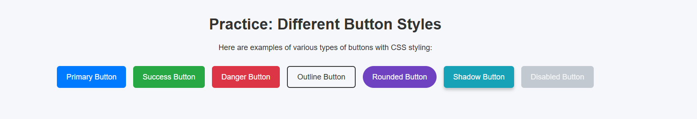
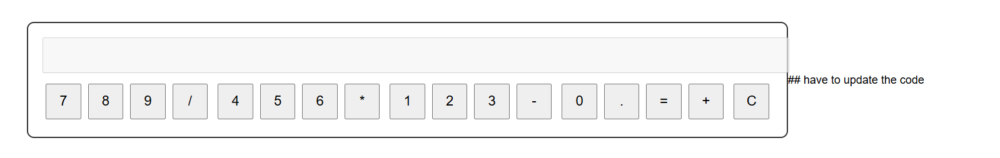
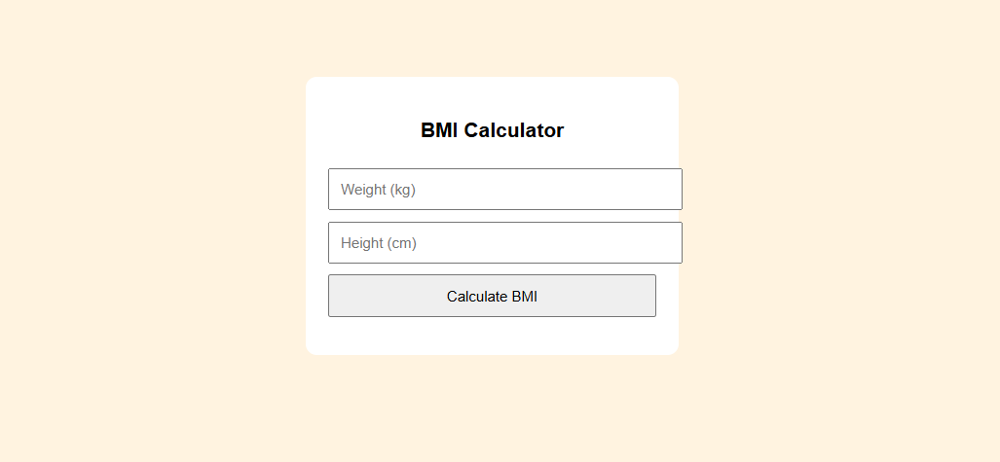

   # 🚀 Web Projects Collection
THIS IS MY FIRST PROJECT WHAT I HAVE BUILD., 

This repository contains three small frontend projects built with **HTML**, **CSS**, and **JavaScript**.  

Included projects:
🏋️ Fitness Club Landing Page
A simple landing page for a fitness club, featuring navigation, hero section, and call-to-action buttons.

🎯 Guess the Number Game
A fun number guessing game where the user tries to guess a randomly generated number with hints.

🔘 Button Styles Practice
Practice with different button styles, hover effects, and animations using CSS.

🧮 Calculator
A basic calculator that supports addition, subtraction, multiplication, and division with a simple interface.

🎨 Background Color Changer
Click a button to generate a random background color and display its hex code. Includes a smooth transition effect.

⏰ Digital Clock
Shows real-time hours, minutes, and seconds. Includes a dark/light theme toggle.

📝 Quiz App
A multiple-choice quiz that tracks your score and shows the result at the end.

📝 simple portfolio page

⚖️ BMI Calculator
Calculates Body Mass Index (BMI) and displays the category: Underweight, Normal, Overweight, or Obese.

🎨 Color Picker Tool
Lets users pick a color and shows the chosen color in a box along with its hex code.

⏱️ Countdown Timer
Counts down from a user-specified number of seconds. Displays time in minutes and seconds.

🖼️ Image Slider / Carousel
Rotates through multiple images automatically or using navigation buttons.

⚖️ BMI Calculator
Calculates Body Mass Index (BMI) and displays the category: Underweight, Normal, Overweight, or Obese.

🔐 Password Generator
Generates a random secure password with customizable length.
 

🗣️ Random Quote Generator
Displays a random motivational quote from a predefined list when clicking a button.